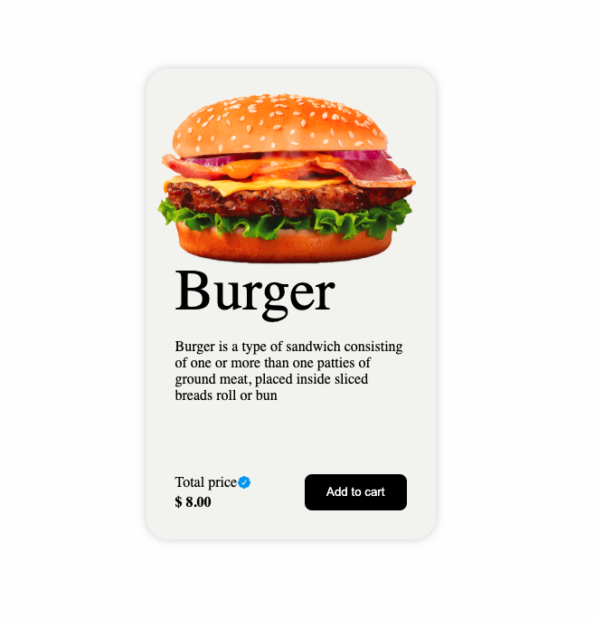
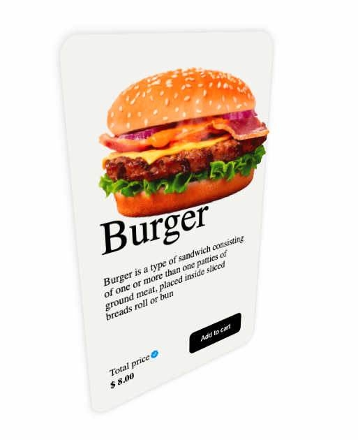

## This project is developed with React, here you can interact with the card with 3d effect. It supports mouse gesture for desktop and touch gesture for mobile devices

## This is how it looks with and without gesture interaction

# Install the dependencies

`npm install`

# To run the project in local

`npm run dev`

# To build the project

`npm run build`

# To see the preview of the build files

`npm run preview`
